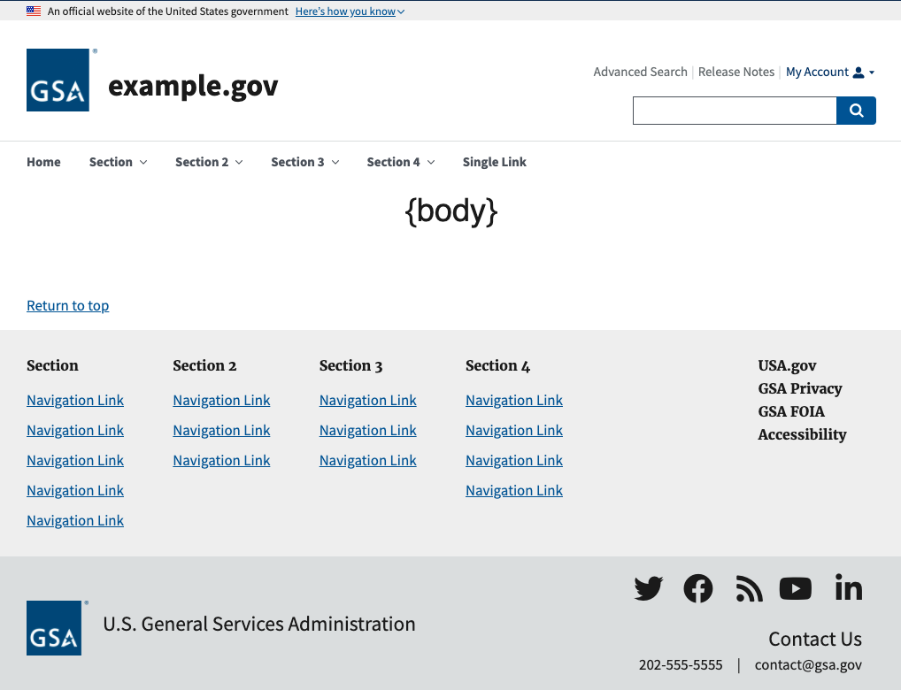

# US Web Design System Salesforce Community Template

An implementation of the US Web Design System for Salesforce Lightning Communities. 

## Installation Instructions

1. Clone or download repository
1. Deploy package via ANT, `ant deployCode`

### Dependencies

* Font Awesome
  * **Required For** fontAwesomeIcon and socialMediaNavMenu components. 
  * Register with Font Awesome to create icon kits, [https://fontawesome.com/start](https://fontawesome.com/start). You'll receive a JS snippet to include in your site. Hold onto that for later.

## Usage Instructions

Once installed, take the following steps to get up and running. If you do not have a Lightning Community set up in a sandbox see [https://help.salesforce.com/articleView?id=networks_creating.htm&type=5](https://help.salesforce.com/articleView?id=networks_creating.htm&type=5).

Once you have a Lightning Community, do the following:

  * Copy javascript snippet from Font Awesome
  * In Salesforce, navigate to Experience Builder > Advanced > Edit Head Markup. Paste in the JS snippet from Font Awesome.

## Major Components

### Base Theme Layout

### USA Website Banner

### Extended Header w/ Mega Menu

Component implements the US Web Design System [Extended Header with Mega Menu](https://designsystem.digital.gov/components/header/#extended-mega-menu). Component relies on two Navigational Menu

### Footer Big

Component implements the US Web Design System [Big Footer](https://designsystem.digital.gov/components/footer/) with one exception, the e-mail signup box. Instead, space for a secondary navigation menu is available where agencies may place links that must be available on all sites. For example, Privacy, FOIA, Accessibility, etc.

### Vertical Navigation

#### Examples

## Accessibility

This template follows the US Web Design System markup as much as possible within the Salesforce interface. Where deviations from the original are required, Salesforce Lightning Design system is sought as a first alternative. 